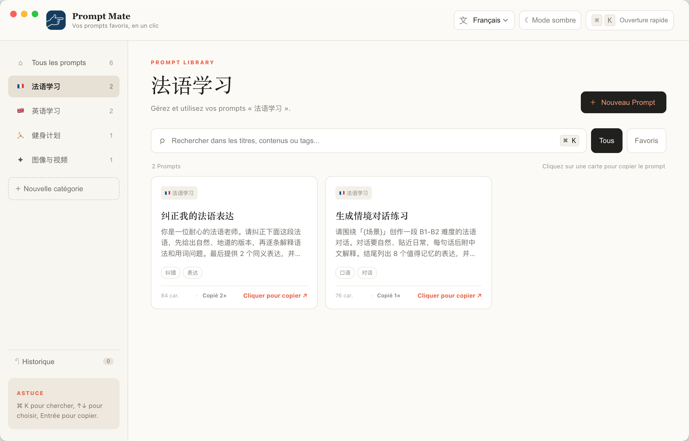
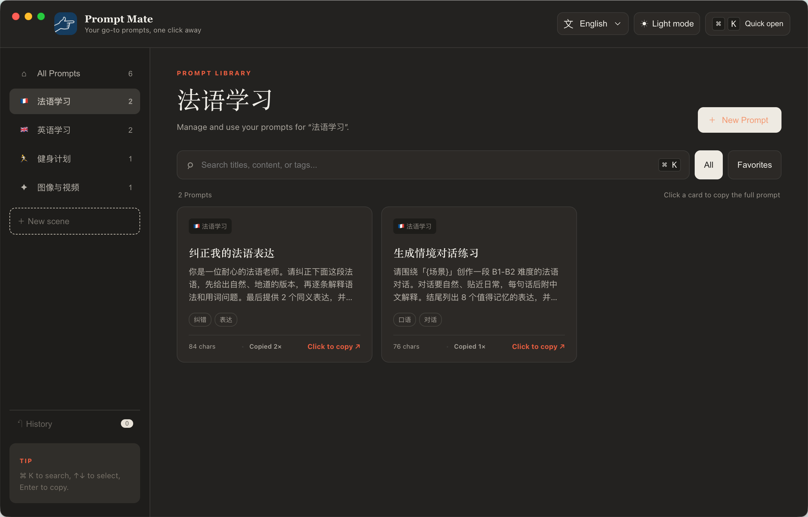

<div align="center">
  
  <h1>Prompt Mate</h1>
  <p><strong>Your go-to prompts, one shortcut away.</strong></p>
  <p>A fast, multilingual prompt library for macOS.</p>
</div>

## Product preview

<p align="center">
  
  
</p>

<p align="center"><em>Light and dark themes with Chinese, English, and French interface options.</em></p>

## Why Prompt Mate?

Useful prompts tend to disappear across notes, chats, and documents. Prompt Mate turns them into a personal, searchable library that stays one keyboard shortcut away—so finding the right instruction feels closer to using an input method than managing a database.

## Features

- Organize prompts into custom scenes
- Search titles, content, and tags instantly
- Copy a full prompt with one click
- Surface the most-used prompts automatically
- Create, rename, and delete scenes
- Edit, favorite, and delete prompts
- Review deleted content in History and clear it when ready
- Switch between Chinese, English, and French interfaces
- Choose light or dark mode
- Open or hide the app globally with `Option + Space`
- Keep all data locally on your Mac

## Product decisions

Prompt Mate started from a simple observation: prompt management is a retrieval problem, not a document-management problem. The interface therefore prioritizes quick search, keyboard navigation, one-click copy, and usage-based ranking. Scenes provide structure without making retrieval slower, while local storage keeps the MVP private and dependency-free.

## Tech stack

- Electron
- Vanilla JavaScript
- HTML and CSS
- Browser local storage

The deliberately lightweight front end keeps the product easy to understand, modify, and package.

## Run locally

Requirements: Node.js 20 or newer and macOS.

```bash
git clone https://github.com/gilbert2046/prompt-mate.git
cd prompt-mate
npm install
npm start
```

## Build the macOS app

```bash
npm run build:mac
```

The generated app will be available at:

```text
dist/mac-arm64/Prompt Mate.app
```

The current build targets Apple Silicon Macs. Distribution builds are unsigned; macOS code signing and notarization are planned for a future release.

## Web preview

```bash
node server.js
```

Then open [http://localhost:4173](http://localhost:4173).

## Keyboard shortcuts

| Shortcut | Action |
| --- | --- |
| `Option + Space` | Show or hide Prompt Mate |
| `Command + K` | Focus search |
| `↑` / `↓` | Select a prompt |
| `Enter` | Copy selected prompt |
| `Escape` | Clear and leave search |

## Privacy

Prompt Mate does not send prompts to a server. In this MVP, scenes, prompts, preferences, and usage counts remain in local application storage on the device.

## Roadmap

- Import and export prompt libraries
- Prompt variables and fill-in templates
- Optional cloud sync
- Menu-bar mode and compact floating panel
- Signed and notarized macOS releases

## License

Released under the [MIT License](LICENSE).
